# Chapter 8 Cluster analysis
Julia and Kat  
22 January 2016  

## Intro {.build}

- Why use clustering?
    - does not test a hypothesis, but brings out hidden aspects of the data.
    - explore species associations

- Type of data you would use
- What you will get out of it
- different kinds of clustering: can be hard (either you are a or b) or can be fuzzy (you are somewhere between 0 and 1). 
    - we will talk about hard clustering


## Plan for today

- Vocab
- Types of clustering:
    - Single linkage agglomerative
    - UPGMA
    - K-means
- Comparing clustering results to original data
- Species associations
- Indicator species analysis
- Seriation
- MRT?
- Statistics and validation of clustering


## Vocabulary {.build}

- types of clustering (section 8.4)
    - Sequential vs. simultaneous
    - Agglomeration vs. division
    - Monothetic vs. polythetic methods
    - Hierarchical vs non-hierarchical
    - constrained
    - probabilistic vs. non-probabilistic

## Clustering using Single Linkage agglomeration

- hierarchical agglomerative clustering
- aka nearest neighbour sorting
- can be difficult to interpret in terms of partitions, but gradients are revealed quite clearly. 
- two objects fuse when they are closest to each other

- will use dune dataset from vegan package


```r
library(vegan)
data(dune)
```

## Dune data

30 species at 20 sites. Meadow vegetation data from Dutch Dune Meadows.

For illustration purposes let's just use first 6 rows(sites) of cover class data


```r
dune_six_sites <- head(dune)
dune_six_sites
```

```
##   Achimill Agrostol Airaprae Alopgeni Anthodor Bellpere Bromhord Chenalbu
## 1        1        0        0        0        0        0        0        0
## 2        3        0        0        2        0        3        4        0
## 3        0        4        0        7        0        2        0        0
## 4        0        8        0        2        0        2        3        0
## 5        2        0        0        0        4        2        2        0
## 6        2        0        0        0        3        0        0        0
##   Cirsarve Comapalu Eleopalu Elymrepe Empenigr Hyporadi Juncarti Juncbufo
## 1        0        0        0        4        0        0        0        0
## 2        0        0        0        4        0        0        0        0
## 3        0        0        0        4        0        0        0        0
## 4        2        0        0        4        0        0        0        0
## 5        0        0        0        4        0        0        0        0
## 6        0        0        0        0        0        0        0        0
##   Lolipere Planlanc Poaprat Poatriv Ranuflam Rumeacet Sagiproc Salirepe
## 1        7        0       4       2        0        0        0        0
## 2        5        0       4       7        0        0        0        0
## 3        6        0       5       6        0        0        0        0
## 4        5        0       4       5        0        0        5        0
## 5        2        5       2       6        0        5        0        0
## 6        6        5       3       4        0        6        0        0
##   Scorautu Trifprat Trifrepe Vicilath Bracruta Callcusp
## 1        0        0        0        0        0        0
## 2        5        0        5        0        0        0
## 3        2        0        2        0        2        0
## 4        2        0        1        0        2        0
## 5        3        2        2        0        2        0
## 6        3        5        5        0        6        0
```

ref: Jongman, R.H.G, ter Braak, C.J.F & van Tongeren, O.F.R. (1987). Data Analysis in Community and Landscape Ecology. Pudoc, Wageningen.

## Step 1 : Distance matrix

Calculate distance matrix (Chapter 7)


```r
dune_bray <- vegdist(dune_six_sites) ## default is Bray-Curtis
dune_bray
```

```
##           1         2         3         4         5
## 2 0.4666667                                        
## 3 0.4482759 0.3414634                              
## 4 0.5238095 0.3563218 0.2705882                    
## 5 0.6393443 0.4117647 0.4698795 0.5000000          
## 6 0.6363636 0.5111111 0.5681818 0.6344086 0.2967033
```

## Step 1 : Distance matrix
Check it out with ```coldiss()``` from last time.

```r
source("../Chapter_7/coldiss.R")
coldiss(dune_bray)
```

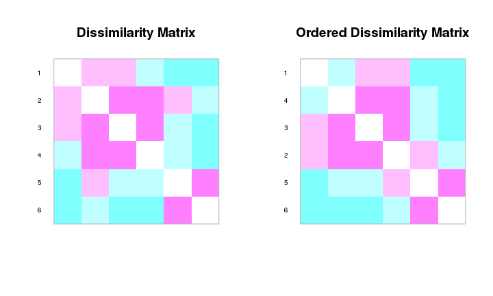 


## Step 2 : Order D by pairs in lowest to highest distance
Get distance matrix into sets of pairs (links) of distances (like Fig 8.2)

```r
library(reshape2) ## need for melt()
melt(as.matrix(dune_bray), varnames = c("row", "col")) # take distance matrix into "long" format
```

```
##    row col     value
## 1    1   1 0.0000000
## 2    2   1 0.4666667
## 3    3   1 0.4482759
## 4    4   1 0.5238095
## 5    5   1 0.6393443
## 6    6   1 0.6363636
## 7    1   2 0.4666667
## 8    2   2 0.0000000
## 9    3   2 0.3414634
## 10   4   2 0.3563218
## 11   5   2 0.4117647
## 12   6   2 0.5111111
## 13   1   3 0.4482759
## 14   2   3 0.3414634
## 15   3   3 0.0000000
## 16   4   3 0.2705882
## 17   5   3 0.4698795
## 18   6   3 0.5681818
## 19   1   4 0.5238095
## 20   2   4 0.3563218
## 21   3   4 0.2705882
## 22   4   4 0.0000000
## 23   5   4 0.5000000
## 24   6   4 0.6344086
## 25   1   5 0.6393443
## 26   2   5 0.4117647
## 27   3   5 0.4698795
## 28   4   5 0.5000000
## 29   5   5 0.0000000
## 30   6   5 0.2967033
## 31   1   6 0.6363636
## 32   2   6 0.5111111
## 33   3   6 0.5681818
## 34   4   6 0.6344086
## 35   5   6 0.2967033
## 36   6   6 0.0000000
```


## Step 2 : Order D by pairs in lowest to highest distance


```r
## as.matrix() fills in upper triangle, so need to add a filtering bit ( in [] )
## to avoid duplicates
long_dune_dist <- melt(as.matrix(dune_bray),
                       varnames = c("row", "col"))[melt(lower.tri(dune_bray))$value,]
long_dune_dist
```

```
##    row col     value
## 2    2   1 0.4666667
## 3    3   1 0.4482759
## 4    4   1 0.5238095
## 5    5   1 0.6393443
## 6    6   1 0.6363636
## 9    3   2 0.3414634
## 10   4   2 0.3563218
## 11   5   2 0.4117647
## 12   6   2 0.5111111
## 16   4   3 0.2705882
## 17   5   3 0.4698795
## 18   6   3 0.5681818
## 23   5   4 0.5000000
## 24   6   4 0.6344086
## 30   6   5 0.2967033
```


## Step 2 : Order D by pairs in lowest to highest distance
sort the matrix by distance between pairs

```r
ordered_long_dune_dist <- long_dune_dist[order(long_dune_dist$value),]
ordered_long_dune_dist
```

```
##    row col     value
## 16   4   3 0.2705882
## 30   6   5 0.2967033
## 9    3   2 0.3414634
## 10   4   2 0.3563218
## 11   5   2 0.4117647
## 3    3   1 0.4482759
## 2    2   1 0.4666667
## 17   5   3 0.4698795
## 23   5   4 0.5000000
## 12   6   2 0.5111111
## 4    4   1 0.5238095
## 18   6   3 0.5681818
## 24   6   4 0.6344086
## 6    6   1 0.6363636
## 5    5   1 0.6393443
```


## Step 3: Make links between pairs 
Clusters will be joined by pairs based on lowest distance

We showed reordering just so we could understand and anticipate what would happen

If we go back to our distance matrix and use the clustering function

```r
dune_bray_single <- hclust(dune_bray, method="single")
dune_bray_single
```

```
## 
## Call:
## hclust(d = dune_bray, method = "single")
## 
## Cluster method   : single 
## Distance         : bray 
## Number of objects: 6
```

Object to be clustered is no more distant from the distance level 
from *at least* one object already in cluster. 

(We will talk later about how this is different from complete linkage)


## Step 4: Plot dendrogram 
Dendrogram shows topology, not all possible links

```r
plot(dune_bray_single)
```

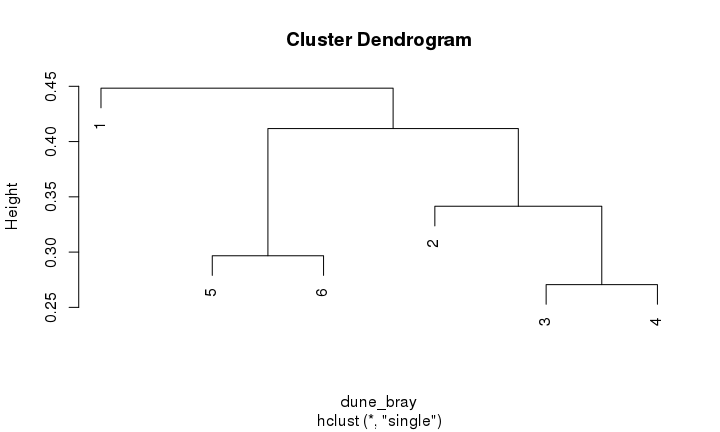 


## Can also visualize like a graph
Like in figure 8.2
- if we look at the pairs that occur at distances below 0.3

```r
library(igraph)

dune_ch_graph <- graph.adjacency(as.matrix(dune_bray) < 0.30,
                                 mode="undirected",
                                 weighted=TRUE)
plot(dune_ch_graph)
```

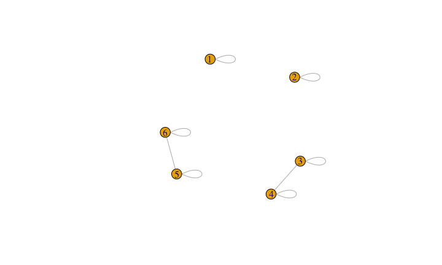 

## Can also visualize like a graph
Simplify removes self-loops

```r
plot(simplify(dune_ch_graph))
```

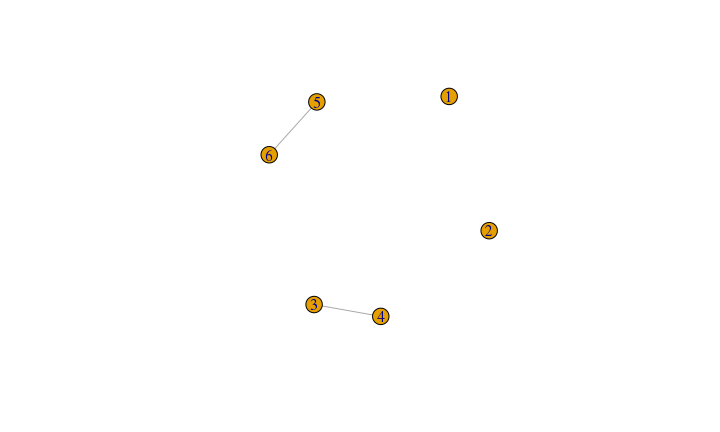 


## Can also visualize like a graph


```r
dune_ch_graph <- graph.adjacency(as.matrix(dune_bray) < 0.40,
                                 mode="undirected",
                                 weighted=TRUE)
plot(simplify(dune_ch_graph))
```

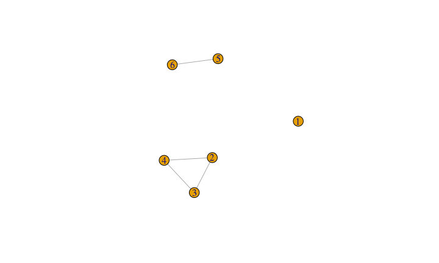 

## Can also visualize like a graph


```r
dune_ch_graph <- graph.adjacency(as.matrix(dune_bray) < 0.50,
                                 mode="undirected",
                                 weighted=TRUE)
plot(simplify(dune_ch_graph))
```

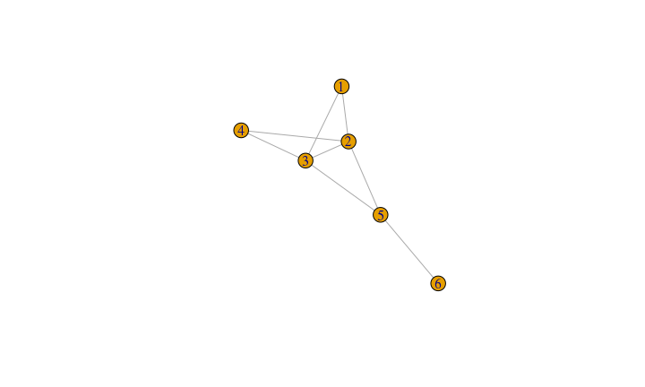 

## Back to dendrogram


```r
plot(dune_bray_single)
```

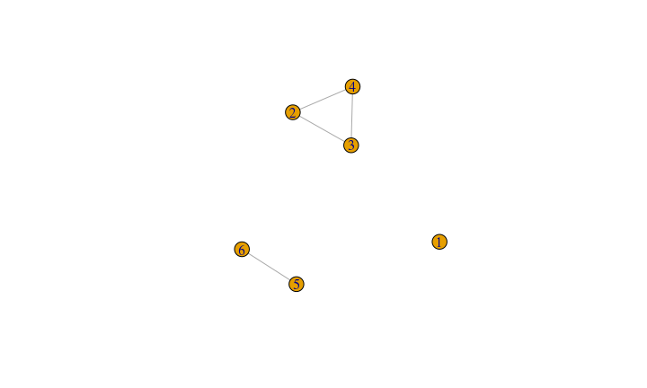 

## How does clustering result compare to original distance matrix?

Cophenetic distance is distance where objects become members of same cluster

```r
dune_bray_single_coph <- cophenetic(dune_bray_single)
dune_bray_single_coph
```

```
##           1         2         3         4         5
## 2 0.4482759                                        
## 3 0.4482759 0.3414634                              
## 4 0.4482759 0.3414634 0.2705882                    
## 5 0.4482759 0.4117647 0.4117647 0.4117647          
## 6 0.4482759 0.4117647 0.4117647 0.4117647 0.2967033
```


## How does clustering result compare to original distance matrix?

```r
cor(dune_bray, dune_bray_single_coph)
```

```
## [1] 0.8123345
```


## Sheppard-like diagram


```r
plot(dune_bray, dune_bray_single_coph, xlab="Bray-Curtis", ylab="Cophenetic distance", asp=1,
     main = c("Single linkage", paste("Cophenetic correlation", 
                                      round(cor(dune_bray, dune_bray_single_coph), 
                                            digits=2))))
abline(0,1)
```

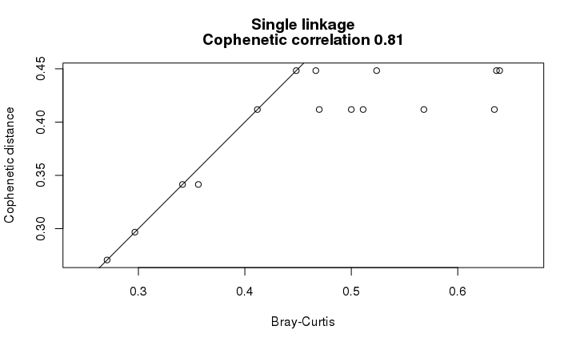 


## Comparison: **Complete** linkage

```r
dune_bray_complete <- hclust(dune_bray, method="complete")
```
  - opposite to single linkage - "Furthest neighbour sorting"
  - useful for identifying discontinuities in the data
  - so object can join cluster only when it is linked to all objects in the cluster

 

## Cophenetic for complete linkage

```r
dune_bray_complete_coph <- cophenetic(dune_bray_complete)
```

## Sheppard-like diagram


```r
par(mfrow=c(1,2))
plot(dune_bray, dune_bray_complete_coph, xlab="Bray-Curtis", ylab="Cophenetic distance", asp=1,main = c("Complete linkage", paste("Cophenetic correlation", round(cor(dune_bray,dune_bray_complete_coph), digits=2))))
abline(0,1)
plot(dune_bray, dune_bray_single_coph, xlab="Bray-Curtis", ylab="Cophenetic distance", asp=1,main = c("Single linkage", paste("Cophenetic correlation", round(cor(dune_bray, dune_bray_single_coph), digits=2))))
abline(0,1)
```

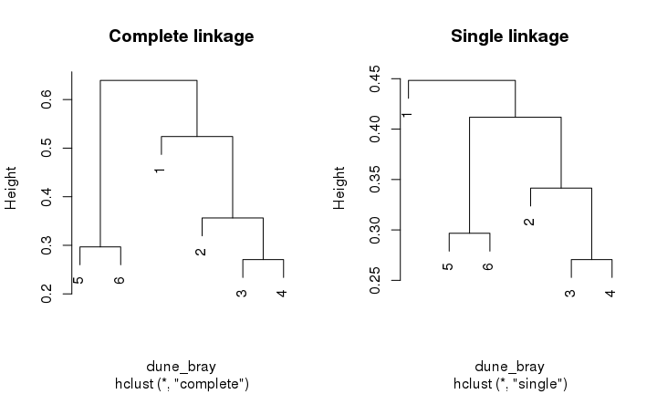 

## Comparison of agglomerative linkage methods

### Intermediate
How does single linkage agglomeration compare to:

- intermediate linkage agglomerative clustering
- object needs to meet criteria to of a proportion of group to join the group
- so can choose something like proportional link linkage criterio(C0 = 50%)
- not sure what command is in R. ??


## Average clustering methods:

- either arithmetic or centroid 
- equal weights or unequal weights


##


## UPGMA - unweighted arithmetic average clustering
UPGMA = Unweighted pair-group method using Arithmetic averages

- lowest distance identifies next cluster to be formed
- calculates average between an object and each of the cluster members


```r
dune_bray_UPGMA <- hclust(dune_bray, method="average")
```

## UPGMA vs single linkage

```r
par(mfrow=c(1,2))
plot(dune_bray_UPGMA, main = "UPGMA")
plot(dune_bray_single, main = "Single linkage")
```

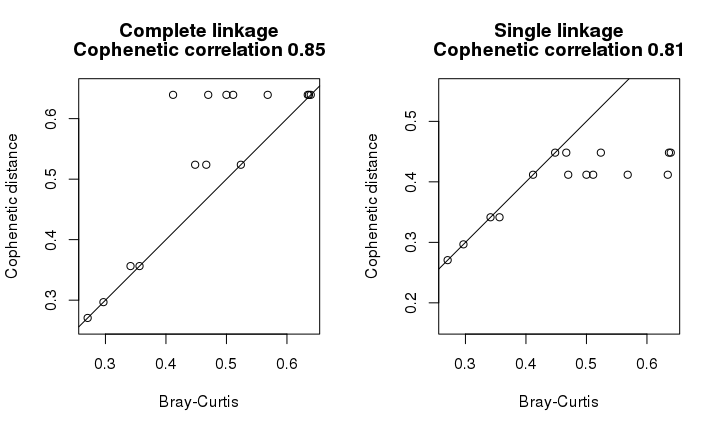 

## Differences among centroid clustering methods
Sections 8.5.4 - 8.5.7

- UPGMA : unweighted arithmetic average clustering
    - ```hclust(dune_bray, method="average")```
    - final fusion step:
  (0.9645x1 + 0.93075x2)/3 = 0.942
  
- WPGMA : weighted pair-group average clustering
    - ```hclust(dune_bray, method="mcquitty")```
    - downweights distances from larger group
    - final fusion step:
    (0.9645+ 0.93075)/2 = 0.947625
  
## Differences among centroid clustering methods
Sections 8.5.4 - 8.5.7 

- use centroids- type object of cluster (doesn't have to be real object)
- in attribute space, A-space (Fig 7.2)
- UPGMC : unweighted pair-group centroid method
    - ```hclust(dune_bray, method="centroid")```
- WPGMC : weighted pair-group centroid method
    - ```hclust(dune_bray, method="median")```
- compare step 4 centroids in Figs 8.8 and 8.10

## Ward's agglomerative clustering method

- related to centroid methods
- starts with each object in own cluster, distance to centroid is 0
- clusters are formed that minimize squared error
- (minimizes distance that centroids move away from objects when new objects added to cluster )

- Equations 8.5 and 8.6 squared error


## Ward's agglomerative clustering method


```r
spe.ch.ward <- hclust(dune_bray, method="ward.D") ## also "ward.D2"
plot(spe.ch.ward)
```

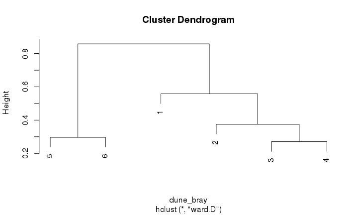 


## K-means 
- non-hierarchical method
- partition *n* objects into *k* clusters
- linear method -not appropriate for raw species abundance with lots of zeroes, but can transform data

medoid = type object representing a cluster

local minimum = solution can be "stuck" depending on the starting position of objects

## K-means 
Starting position can be:

- random
- based on a hypothesis
- using hierarchical clustering


- process: 
    - compute cluster centroids and use as new cluster seeds
    - assign each object to nearest seed

- iterations:
    - *k* observations selected as "seeds"
    - try to reduce sum of squared errors if possible
    - stopped after E^2^~k~ can no longer be improved

## K-means 

```r
dune_kmeans <- kmeans(dune_six_sites, centers=4, nstart=100)

dune_hellinger <- decostand(dune_six_sites,"hellinger")
dune_KM_cascade <- cascadeKM(dune_hellinger, inf.gr=2, sup.gr=3, iter=100, criterion="ssi")
plot(dune_KM_cascade, sortg=TRUE)
```

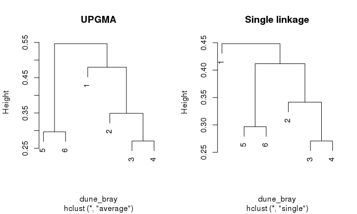 


## K-means 

```r
summary(dune_KM_cascade)
```

```
##           Length Class  Mode     
## partition 12     -none- numeric  
## results    4     -none- numeric  
## criterion  1     -none- character
## size       6     -none- numeric
```

```r
dune_KM_cascade$results
```

```
##      2 groups   3 groups
## SSE 0.9341624 0.53009876
## ssi 0.0606446 0.08725346
```

```r
dune_KM_cascade$partition
```

```
##   2 groups 3 groups
## 1        1        3
## 2        1        2
## 3        1        2
## 4        1        2
## 5        2        1
## 6        2        1
```


## Indicator species analysis

- species that characterize a site or habitat
- uses prior clustering to calculate species
- calculate specificity (A~j~~k~) and fidelity (B~j~~k~)
    - get INDVAL~j~~k~ value by multiplying (equation 8.21)

```r
 groups <-  cutree(dune_bray_single, k=3)

library(indicspecies)
# Look for the indicator species
indval <- multipatt(dune_six_sites, groups)
summary(indval)
```

```
## 
##  Multilevel pattern analysis
##  ---------------------------
## 
##  Association function: IndVal.g
##  Significance level (alpha): 0.05
## 
##  Total number of species: 30
##  Selected number of species: 0 
##  Number of species associated to 1 group: 0 
##  Number of species associated to 2 groups: 0 
## 
##  List of species associated to each combination: 
## ---
## Signif. codes:  0 '***' 0.001 '**' 0.01 '*' 0.05 '.' 0.1 ' ' 1
```


## Seriation

- origin in archaeology

```r
heatmap(as.matrix(dune_bray))
```

 

## Multivariate regression tree (MRT)


```r
library(mvpart)
data("dune.env")
dune_env_six <- head(dune.env)
mvpart(data.matrix(dune_bray) ~., dune_env_six)
```

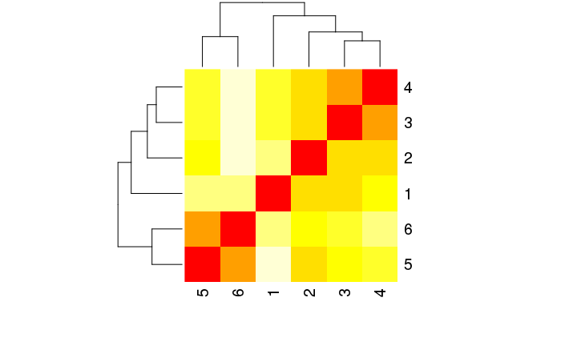 


## Cluster Statistics and validation

- cophenetic distance and Shepard-like diagram
- connectedness within clusters and isolation of clusters

Validation:

- plot using ordination and overlay clusters (coming next week?)
- compare various clustering algorithms


## Cluster algorithms in other applications

- sequence clustering- group DNA reads into clusters using distance matrix

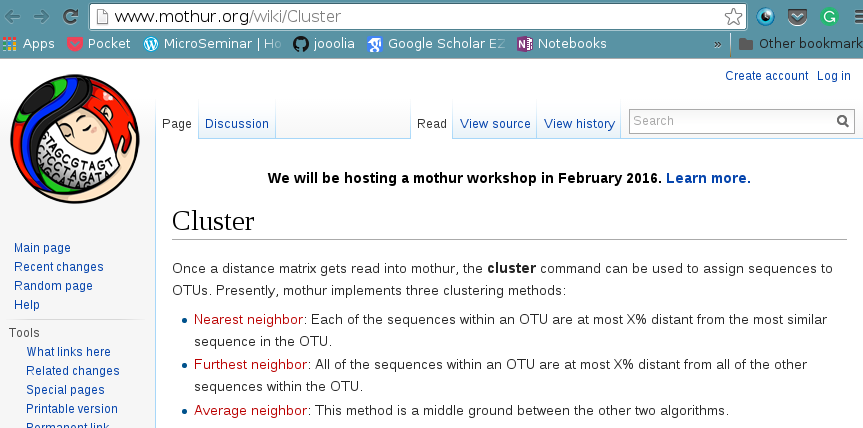

## Resources

- [vegan clustering tutorial(pdf)](http://cc.oulu.fi/~jarioksa/opetus/metodi/sessio3.pdf)
- [GUSTA ME pages](http://mb3is.megx.net/gustame/dissimilarity-based-methods/cluster-analysis)
- [Chapter 4 Borcard et al, 2011](http://ubc.summon.serialssolutions.com/#!/search?bookMark=ePnHCXMw42LgTQStzc4rAe_hSmGAziRCD3MFdlhMDC11zYG1oC4oukHteUsQL4IZev4ShA-65UxUIzwxODU4WBNarpqYmwHb5xywERQon5NBwq8UMruRo5AKPuq5UgE0iKkQxM0g5eYa4uyhW5qUHA8dDok3BTaQQZU-N4MBRBI2ARpfADnfIR7DnfGGFsA-JOhqdWWIFqD6osTclMx08MUeMH3GwO6BMeiWZSWIKuR9THBFwO4CaKMT3CjI5Ciy3fAgMUOoQvYAbFoq3tQSdLweaMocjzcBvT1wAg)


##

